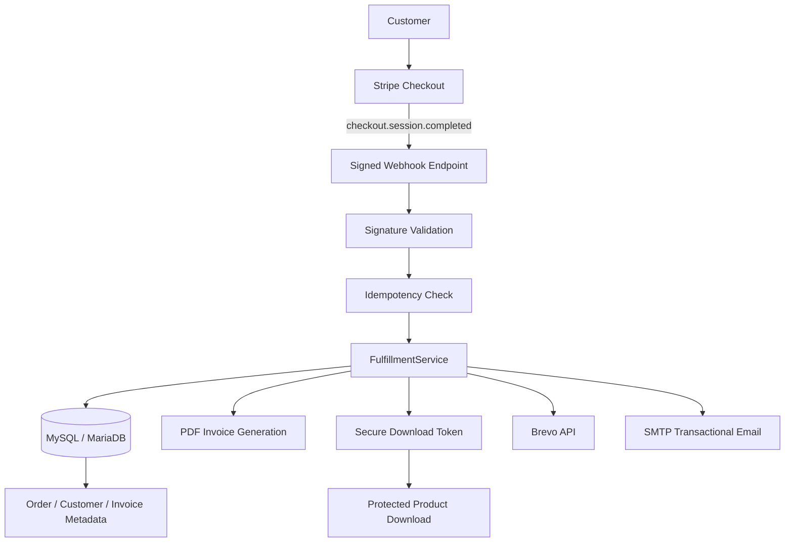

# Digital Commerce & Fulfillment Automation

A sanitized and refactored code sample based on a real production workflow I built for selling and automatically delivering digital products.

The original production application connects checkout, payment processing, webhook validation, database persistence, invoice generation, CRM synchronization, transactional email and protected digital delivery. This repository intentionally excludes production credentials, customer data, commercial product files, branding and proprietary content.

## What this project demonstrates

- REST/API and third-party system integration
- Stripe Checkout and signed webhook validation
- Idempotent webhook processing
- Transactional database workflows with PDO/MySQL
- Secure, expiring download tokens with download limits
- Automated PDF invoice generation
- SMTP transactional email
- Brevo CRM/contact synchronization
- Error handling and operational logging
- Separation of secrets from source code
- Production-oriented PHP application structure

## Architecture



## Important integration decisions

### Webhook signature verification

Incoming Stripe events are validated with Stripe's webhook signing secret before any business logic is executed.

### Idempotency

Payment providers may retry webhook deliveries. The Stripe Checkout Session ID is stored with a unique constraint and checked before fulfillment, preventing duplicate orders and duplicate product delivery.

### Database transaction boundaries

Order creation, invoice metadata and download-token creation are committed as one database transaction. External CRM and email calls happen after that transaction, preventing slow third-party services from holding database locks.

### Protected digital delivery

The public URL never exposes the private product path. A cryptographically random 64-character token is generated for each purchase and checked for expiration and download limits before serving a file.

### Secret management

Real credentials are never committed. `config/env.example.php` documents the required configuration while `config/env.php` is ignored by Git.

## Project structure

```text
config/
  env.example.php        Example configuration only
public/
  create-checkout.php    Creates a Stripe Checkout Session
  webhook.php            Validates and routes Stripe webhook events
  download.php           Token-protected digital delivery
src/
  Database.php           PDO connection factory
  FulfillmentService.php Orchestrates order fulfillment
  BrevoService.php       CRM/contact integration
  Mailer.php             Transactional email
  InvoiceGenerator.php   PDF invoice generation
storage/
  products/              Private files; ignored by Git
  invoices/              Generated invoices; ignored by Git
schema.sql                Minimal demo database schema
```

## Local setup

Requirements:

- PHP 8.1+
- Composer
- MySQL or MariaDB
- PHP extensions: PDO MySQL, cURL

Install dependencies:

```bash
composer install
```

Create local configuration:

```bash
cp config/env.example.php config/env.php
```

Create the database tables:

```bash
mysql -u YOUR_USER -p YOUR_DATABASE < schema.sql
```

Add your own test credentials to `config/env.php` and a local demo file to `storage/products/`.

For Stripe webhook development, use Stripe's test environment and configure the webhook endpoint to point to `public/webhook.php`.

## Security notes

This repository contains no production secrets or customer records. Commercial product files and generated invoices are excluded by `.gitignore`.

For a production deployment I would additionally apply environment-specific access controls, rate limiting where appropriate, centralized logging/monitoring, credential rotation and stricter file-serving controls at the web-server layer.

## Background

This repository is intentionally a focused engineering sample rather than a copy of the complete commercial website. It demonstrates the integration and automation layer while protecting product content and production configuration.
